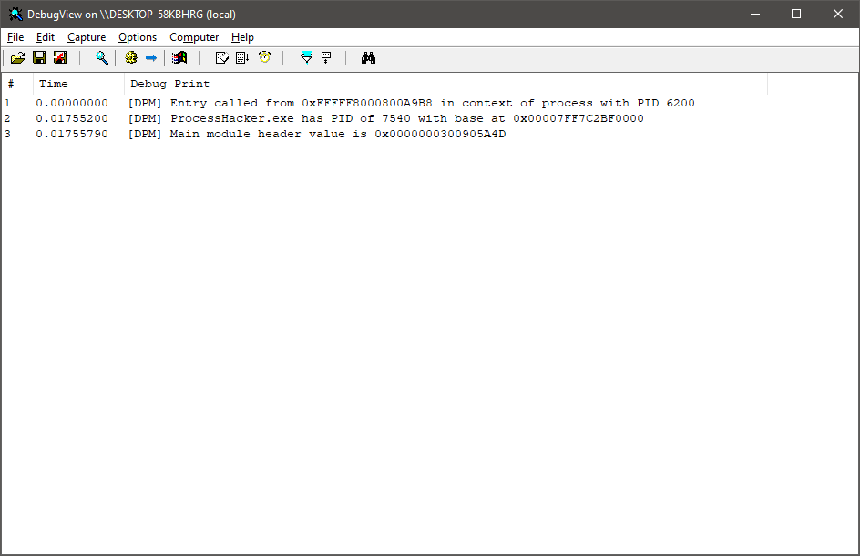

# Direct Page Manipulation (DPM)
This is a bare minimum example project that demonstrates how to overwrite paging structures directly to read/write into physical memory, and how to use this for interprocess memory copying. This project doesn't take into account paged-out memory and, more importantly, multithreading, in order to keep it as simple to understand as possible.

Some functions are rightfully stolen from [here](https://www.unknowncheats.me/forum/anti-cheat-bypass/444289-read-process-physical-memory-attach.html).